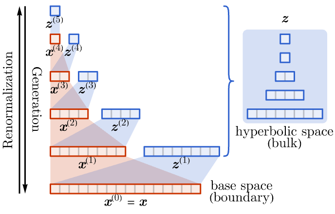
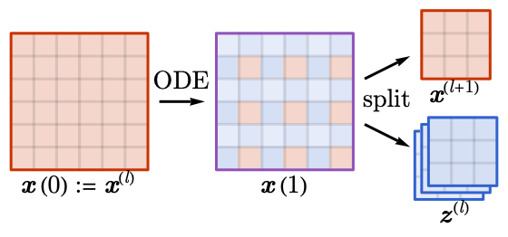
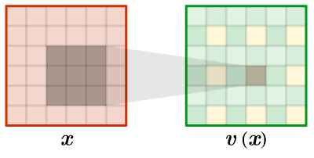

# RG-Flow (ODE implementation)
 
This is a Pytorch implementation of the arXiv paper [arXiv:2203.07975](https://arxiv.org/abs/2203.07975): Categorical Representation Learning and RG flow operators for algorithmic classifiers by Artan Sheshmani, Yizhuang You, Wenbo Fu, and Ahmadreza Azizi.
 
 **RG-Flow** is a hierarchical flow-based generative model built on the idea of renormalization group (RG) in physics. It was originally introduced in Ref. [1] under the name of "NeuralRG" as a flow-based generative model on a multi-scale entanglement renormalization ansatz (MERA) network structure in physics. Ref. [2] lays down the theoretical foundation between the hierarchical flow-based generative model and the modern understanding of renormalization group flow as an optimal transport that disentangles a quantum field theory. The architecture is simplified as the model develops. The technology is further applied to image generation [3] and sequence generation [4]. This repository hosts an implementation of RG-Flow based on neural ODE bijectors. It can learn to generate new samples and estimate sample log-likelihood given (i) either a set of training samples (ii) or an energy function that describes the sample distribution (as a Boltzmann distribution).

[1] [arXiv:1802.02840](https://arxiv.org/abs/1802.02840): Shuo-Hui Li and Lei Wang, *Neural Network Renormalization Group*. (Associated GitHub repository: [NeuralRG](https://github.com/li012589/NeuralRG))

[2] [arXiv:1903.00804
](https://arxiv.org/abs/1903.00804): Hong-Ye Hu, Shuo-Hui Li, Lei Wang, Yi-Zhuang You. *Machine Learning Holographic Mapping by Neural Network Renormalization Group*.

[3] [arXiv:2010.00029](https://arxiv.org/abs/2010.00029): Hong-Ye Hu, Dian Wu, Yi-Zhuang You, Bruno Olshausen, Yubei Chen. *RG-Flow: A hierarchical and explainable flow model based on renormalization group and sparse prior*. (Associated GitHub repository: [RG-Flow (MERA implementation)](https://github.com/hongyehu/RG-Flow))

[4] [arXiv:2203.07975](https://arxiv.org/abs/2203.07975): Artan Sheshmani, Yizhuang You, Wenbo Fu, and Ahmadreza Azizi. *Categorical Representation Learning and RG flow operators for algorithmic classifiers*. 

## Architecture Overview

* **Generative Model**. RG-Flow models the probability distribution $p_X(\mathbf{x})$ of data $\mathbf{x}$ as the pullback of a base distribution $p_Z(\mathbf{z})$ through the bijective transformation $R:\mathbf{x}\mapsto\mathbf{z}$, such that $$p_X(\mathbf{x})=p_Z(\mathbf{z})\det\left(\frac{\partial\mathbf{z}}{\partial\mathbf{x}}\right).$$
* **RG Flow**. The bijective transformation $R:\mathbf{x}\mapsto\mathbf{z}$ is implemented as hierarchical bijective maps that progressively extract irrelevant features from relevant features following the idea of renormalization group transformation. The mapping is also considered a holographic encoding map from the visible data $\mathbf{x}$ (in a $d$-dimensional base space, i.e. holographic boundary) to the latent features $\mathbf{z}$ (in the $(d+1)$-dimensional hyperbolic space, i.e. holographic bulk).
  

    
  

  $$\mathbf{x}^{(0)}=\mathbf{x},$$
  $$\mathbf{x}^{(l)},\mathbf{z}^{(l)}=R_l(\mathbf{x}^{(l-1)})\quad(\text{for }l=1,2,\cdots,n),$$
  $$\mathbf{z}=\mathrm{concat}[\mathbf{z}^{(1)},\mathbf{z}^{(2)},\cdots,\mathbf{z}^{(n)}].$$
* **RG Layer**. Each layer of the bijective map $R_l:\mathbf{x}^{(l-1)}\mapsto\mathbf{x}^{(l)},\mathbf{z}^{(l)}$ is realized as a ordinary differential equation (ODE) evolution of the input followed by a splitting of relevant and irrelevant features.
  

    
  

  The ODE is specified by a velocity function $\mathbf{v}(\mathbf{x},t)$
  $$\frac{\mathrm{d}\mathbf{x}(t)}{\mathrm{d}t}=\mathbf{v}(\mathbf{x}(t),t).$$
  The ODE evolution starts with the initial condition $\mathbf{x}(t=0)=\mathbf{x}^{(l-1)}$ and evolves from $t=0$ to $t=1$. The final configuration $\mathbf{x}(t=1)$ is then split to relevant features $\mathbf{x}^{(l)}$ and irrelevant features $\mathbf{z}^{(l)}$ following a fixed pattern.
* **ODE Function**. The ODE function $\mathbf{v}(\mathbf{x},t)$ is implemented by a convolutional neural network (CNN) with time-dependent weights and a unit-cell translation symmetry.
  

    
  

